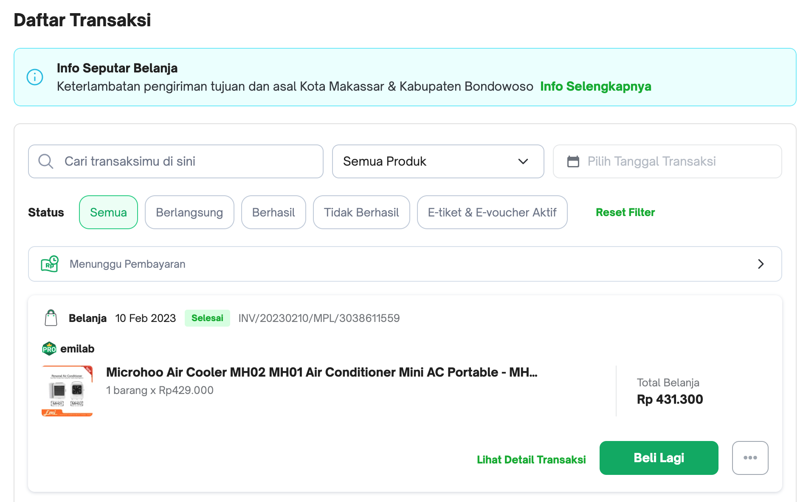

# Soal test maggang Frontend engineer

Berikut adalah soal/pertanyaan yang perlu dijawab oleh peserta maggang

## knowledge base

1. Apa yang anda ketahui tentang Rest API?
   - Cara untuk menghubungkan aplikasi melalui jaringan menggunakan HTTP. Data dikirim dan diterima dalam format seperti JSON atau XML.
3. Apa yang anda ketahui tentang Server side and Client side processing?
   - SSR akan merender di server sedangkan CSR akan merender di sisi client. 
5. Apa yang anda ketahui tentang Design pattern Dependency Injection?
   - Pola desain yang memungkinkan komponen untuk menerima dependensi dari luar, membuat komponen lebih independen, mudah diuji, dan dapat digunakan ulang. 
7. Apa yang anda ketahui tentang Typescript dan Angular framework?
   - TypeScript: Superset dari JavaScript dengan tipe data statis. Membuat pengembangan aplikasi web lebih aman dan terstruktur.
   - Angular: framework javasript dengan penggunaan typescript sebagai bahasa utama.
9. Apa yang anda ketahui tentang Microfrontend?
    - aplikasi web dibagi menjadi modul-modul kecil yang dapat dikelola dan diterbitkan secara independen. Memudahkan pengembangan tim dan pengelolaan aplikasi yang besar. Digunakan dengan kerangka kerja seperti Single-SPA

## Design modules

Dalam suatu schenario ada requirement membuat aplikasi e-commerse seperti Tokopedia seperti berikut:

1. Catalog, pelanggan mencari product di toko
    
2. Item, bisa melihat detail informasi produk
    
3. Cart, pelanggan bisa menambahkan produk yang ingin di beli ke keranjang
    
4. Setelah di checkout, masuk ke list transaction
    
5. Kita juga bisa liat detail transactionya
    

Kemudian temen-temen buat serta jelankan component communication terkait design UI/UX tersebut. contohnya coba breakdown componenet yang ada di module catalog trus coba dijelaskan gimana comunikasinya antara module tersebut.

## Praktek

Berdasarkan analisa tersebut, buat project monorepo (pada repository ini) dengan menggunakan framework [angular.io](https://angular.io/) seperti berikut specifikasinya:

- Data: data yang diperoleh harus menggunakan Rest API, temen-temen boleh menggunakan dummy api seperti [mockachino](https://www.mockachino.com/), [firebase](https://firebase.google.com/) atau sejenisnya
- CSS Framework: bebas, contohnya bootstrap, materialize-css, tailwindcss dan lain-lain
- arhitecture: Silahkan pilih monolith atau microfrontend
